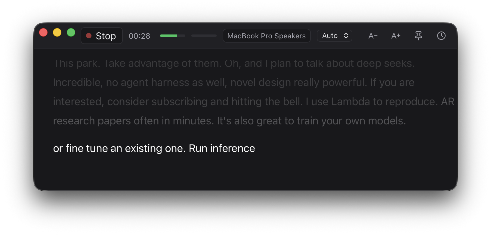
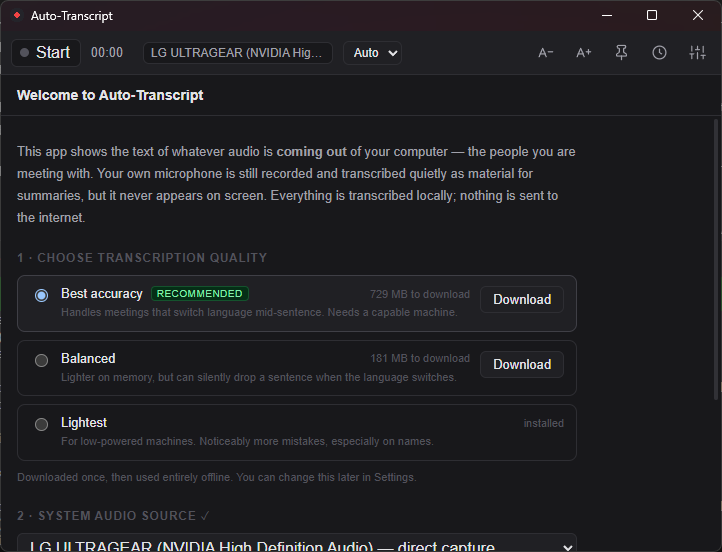
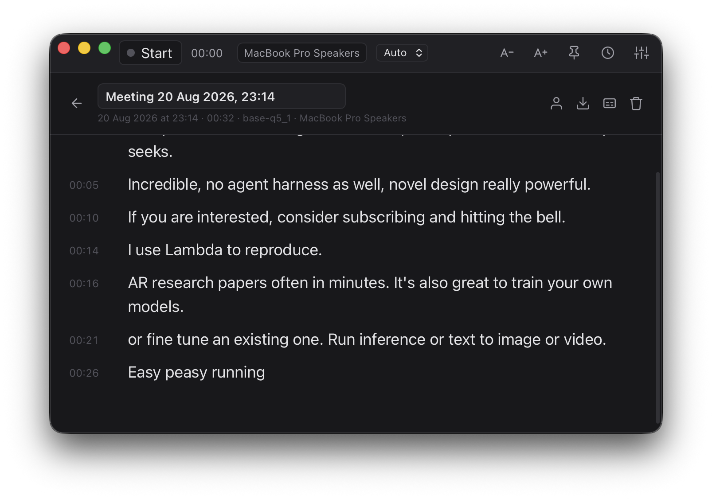

# Auto-Transcript

[](https://github.com/kanam129/auto-transcript/actions/workflows/ci.yml)
[](LICENSE)

Live captions for meetings on macOS. It captures the audio **coming out** of your computer
(the people you are talking to), transcribes it in realtime with Whisper, and shows it as
large text in a dark, resizable window you can pin next to Zoom.

Your microphone is recorded and transcribed quietly as material for AI summaries, but it
**never appears in the transcript window**.

Everything is transcribed locally. The app makes no network connection at all, except to
download a model — or if you explicitly enable AI summaries yourself.



## Install (macOS)

Download the DMG from [Releases](../../releases), open it, and drag the app to
Applications.

### macOS will say the app is damaged. It is not.

These builds are ad-hoc signed rather than signed with a paid Apple Developer ID, so
Gatekeeper refuses them with a misleading message. Clear the quarantine attribute once:

```bash
xattr -dr com.apple.quarantine /Applications/Auto-Transcript.app
```

Then open it normally. There is no way around this short of a $99/year Apple Developer
account — if you would rather not run that command, build from source instead
(see [Development](#development)); locally built apps are never quarantined.

On first launch the app walks you through three steps: choose a transcription quality
level and download it, pick a system audio source, and grant permissions.



**No driver required.** The app taps your output device directly through a CoreAudio
process tap (macOS 14.2+). Your output device is not changed, your volume keys keep
working, and only audio that is actually playing gets recorded.

BlackHole plus a Multi-Output Device still works as a fallback if direct capture is
unavailable, but it is no longer the main path.

## Using it

| Action | How |
|---|---|
| Start / stop recording | The ● button, or **⌘⇧R** — **Ctrl+Shift+R** on Windows (works while the app is in the background) |
| Text size | **⌘+** / **⌘−** / **⌘0** — **Ctrl** on Windows |
| Keep the window on top | The pin icon, top right |
| History and search | The clock icon |
| Fix a wrong word | Double-click the line (in history view) |
| Copy one line | Right-click it |
| Export | Open a session from history → Markdown or SRT |

### Two deliberately different views

**Live** is a reading surface: a fixed reading line, no timestamps, no scrolling. The
sentence being spoken is bright white and always appears at the same height; earlier
sentences fade upward and out. Nothing you are reading moves.

**History** is a browsing surface: timestamps, scrolling, full-text search across every
session, and inline editing.



## Models

| Model | Size | Role |
|---|---|---|
| `large-v3-turbo-q5_0` | 574 MB | Default. The only one that handles mixed-language sentences correctly. |
| `small-q5_1` | 190 MB | Realtime preview text. Reliable on mixed speech. |
| `base-q5_1` | 60 MB | Emergency fallback when the queue falls behind. |

Models are downloaded on first run from
[ggerganov/whisper.cpp on Hugging Face](https://huggingface.co/ggerganov/whisper.cpp) and
verified against a pinned SHA-256. They are not redistributed by this project.

The reasoning behind these choices, with measurements, is in [BENCHMARK.md](BENCHMARK.md).

## Where files live

```
~/Library/Application Support/auto-transcript/
├── data.db                  transcripts, history, search index
├── settings.json
├── models/
└── recordings/<session-id>/{system,mic}.wav      ~58 MB per hour per track
~/Library/Logs/auto-transcript/app.log.YYYY-MM-DD
```

Raw audio is kept so a session can be re-transcribed with a better model later. Automatic
cleanup is configurable under Settings → Storage.

## Windows

Windows installers are produced by CI and attached to each
[release](../../releases). If you want to build one yourself, note that a Windows binary
**cannot be built from macOS**: whisper.cpp has to be compiled with the MSVC toolchain and
Tauri needs the WebView2 SDK, both of which only exist on Windows.

On a Windows PC, install first:

- [Rust](https://rustup.rs) (the default `x86_64-pc-windows-msvc` toolchain)
- [Node.js](https://nodejs.org) 20 or newer
- **Visual Studio Build Tools** with the "Desktop development with C++" workload
- [CMake](https://cmake.org/download/) — make sure it is on PATH
- [LLVM](https://github.com/llvm/llvm-project/releases) — `whisper-rs` generates its
  bindings with bindgen, which loads `libclang.dll` at build time. Without it the build
  stops at `Unable to find libclang`. If it lands somewhere other than
  `C:\Program Files\LLVM`, set `LIBCLANG_PATH` to its `bin` directory.
- WebView2 Runtime (already bundled with Windows 11)

Then:

```powershell
npm install
npm run tauri build
```

Output lands in `src-tauri\target\release\bundle\nsis\` (an .exe installer) and
`...\msi\`.

### What differs on Windows

| Area | Behaviour |
|---|---|
| Capturing system audio | WASAPI loopback — **no driver, no BlackHole**. Just pick your output device. |
| Acceleration | GPU via Vulkan when the machine has one, CPU when it does not, decided at startup. **The CPU alone is not fast enough** — see below. |
| Recommended model | With a GPU, `large-v3-turbo` (the default) is comfortable. Without one, no model keeps up \u2014 not even the lightest. |
| Window chrome | A normal Windows title bar; the macOS traffic-light gutter is not reserved. |

### GPU acceleration is effectively required on Windows

Measured on a desktop i5-12400F with an RTX 3050 (numbers and method in
[BENCHMARK.md](BENCHMARK.md)):

| | CPU only | With Vulkan |
|---|---:|---:|
| `large-v3-turbo` real-time factor | 21.17 | **0.04** |
| Final text behind the speaker | 638 s, growing | **1.43 s** |
| Realtime preview | never appeared | every ~811 ms |

On the CPU every model runs slower than real time, so the queue grows for as long as
anybody is talking. With the GPU the same machine beats the M2 this project was tuned on.

Install the [Vulkan SDK](https://vulkan.lunarg.com/sdk/home), then:

```bat
scripts\build-windows-gpu.bat
```

**One build covers both cases.** Compiling the Vulkan backend in does not commit the
application to using it: at startup it asks the Vulkan loader whether this machine has a
device, uses it when there is one, and stays on the CPU when there is not. A laptop with
no graphics driver runs the same executable as a desktop with a discrete card, and the log
says which one it picked. `AUTO_TRANSCRIPT_GPU=0` forces the CPU, which is the first thing
to try if a driver starts misbehaving.

The script exists because the build has one non-obvious requirement: it must use **Ninja**
rather than the default MSBuild generator. ggml builds its shader generator in a deeply
nested sub-project, and MSBuild's `.tlog` files push the path past the 260-character
Windows limit — which fails with an error that never mentions paths. Visual Studio Build
Tools already ships Ninja, so the script just points CMake at it.

The first recording after a build or a driver update runs about 9 seconds behind while
Vulkan compiles and caches its shaders. It settles by itself.

Being precise about how much this is tested: the Windows build has now been run on real
hardware — it starts, captures system audio through WASAPI loopback with no driver,
downloads its models, and transcribes at the latencies in
[BENCHMARK.md](BENCHMARK.md). Doing that found three bugs CI could not see, because CI
compiles the code but never runs it: the app crashed on startup over a shortcut Windows
had already claimed, the audio stream tore itself down and rebuilt 112 times in 6 seconds,
and `examples/devices.rs` reported a false failure. All three are fixed.

What still has not happened is **an actual meeting**: no soak test, no real speakers, no
VoIP compression, and no measurement in any language other than English, since Windows
ships no Indonesian voice to synthesise one with. A report either way would be genuinely
useful.

## Development

```bash
npm install
npm run tauri dev                 # needs cmake: brew install cmake
cd src-tauri && cargo test        # 15 unit tests
cargo clippy --all-targets -- -D warnings

# tools
cargo run --release --example bench -- a.wav b.wav       # RTF and memory per model
cargo run --release --example e2e -- --offline a.wav     # pipeline without audio devices
cargo run --release --example devices                    # list sources, test direct capture
cargo run --release --example sim -- a.wav               # measure user-perceived latency
cargo run --release --example freshstart                 # verify a clean first run works
```

How it works and why: [ARCHITECTURE.md](ARCHITECTURE.md) · measurements:
[BENCHMARK.md](BENCHMARK.md) · what is left to do: [ROADMAP.md](ROADMAP.md).

## Recording other people

Rules about recording conversations differ by country, and in many places every
participant has to consent. This app cannot check that for you, and does not try to.
Whether you are allowed to record a given meeting is your call.

## Contributing

Bug reports, measurements, and pull requests are welcome — see
[CONTRIBUTING.md](CONTRIBUTING.md). The short version: `cargo clippy -D warnings` must be
clean, and if you change anything that affects latency or accuracy, please put numbers in
[BENCHMARK.md](BENCHMARK.md) rather than describing how it feels.

## Licence

[MIT](LICENSE). Third-party components and their licences are listed in
[THIRD-PARTY-LICENSES.md](THIRD-PARTY-LICENSES.md); model weights are not redistributed by
this project. Privacy and security details are in [SECURITY.md](SECURITY.md).

## AI summaries

Not enabled yet. The whole machinery is in place — an OpenAI-compatible client, map-reduce
for long meetings, key storage in the OS keychain — behind a **Settings → AI summaries**
switch that defaults to off. While that switch is off, the app never touches the network.
